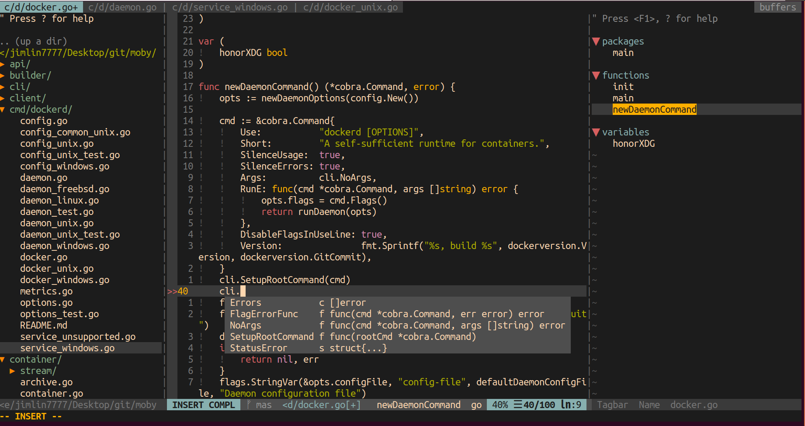

# Moby Development Enviroment Setup For Vim Users
After several days of investigation,
I finally set up my Vim enviroment for developing Moby project.
Then I decide to share my setup steps to you so that
you can save time I have spent before and get to the fun part
(developing with beautiful semantic completion in hand) ASAP!

Happy coding!


## Settings (when I test it)
* Ubuntu 18.04
* Liunx kernel: `5.4.0-48-generic`(`uname -r`)
* Moby project at: <https://github.com/moby/moby/commit/a770dc191eea0a88236b4fb5575fe92efd356800>
    * At that time, go at version: `go version go1.13.14 linux/amd64` (Basically, you can download it from <https://golang.org/dl/go1.13.14.linux-amd64.tar.gz>)
* YouCompleteMe at: <https://github.com/ycm-core/YouCompleteMe/commit/a76659610c500dc3515b1efcc7f3fffdfb6f7df2>
* Vim 8.2 (I installed it from `ppa:jonathonf/vim`) and My `.vim` at: <https://github.com/jimlinntu/.vim2/commit/d3939410c3e80fdc81224b073a3acf65d2a65050>

## Steps
* Make sure your `go` executable can be found in the `$PATH` variable.
* In the `YouCompleteMe` folder (mine is at `~/.vim/bundle/YouCompleteMe/)`, run `python3 install.py --go-completer`
* Get into the Moby project (i.e. `cd moby/`) and run `go mod init` in it. This will take some time. Note that all packages will be installed into `$GOPATH/pkg`. (Note: I still do not know if it is possible to directly use `vendor` folder. If you know how to directly use `vendor` to achieve sematic completion, please let me know.)
After that, a `go.mod` file will appear in the folder.
* According to [this issue](https://github.com/moby/buildkit/pull/1425), you should add these lines (from `moby/vendor/github.com/moby/buildkit/go.mod`)
after the `go.mod` in our current directory (i.e. `moby/`). In my case are these lines:
```
replace (
	github.com/containerd/containerd => github.com/containerd/containerd v1.3.1-0.20200512144102-f13ba8f2f2fd
	github.com/docker/docker => github.com/docker/docker v17.12.0-ce-rc1.0.20200310163718-4634ce647cf2+incompatible
	github.com/hashicorp/go-immutable-radix => github.com/tonistiigi/go-immutable-radix v0.0.0-20170803185627-826af9ccf0fe
	github.com/jaguilar/vt100 => github.com/tonistiigi/vt100 v0.0.0-20190402012908-ad4c4a574305
)
```
* After these steps, you can try to edit a file to check if the semantic completion actually works:
```
cd moby/
vim cmd/dockerd/docker.go
```

## Troubleshootings
* (In Vim): `:YcmDebugInfo`
* `go env`, `go env GOPATH`

## Contributions
Contributions are welcomed!
To be honest, I am actually not very experienced in golang,
so if you have a better way to setup moby project semantic completion development enviroment for Vim,
please let me know!

## References
* <https://medium.com/@adiach3nko/package-management-with-go-modules-the-pragmatic-guide-c831b4eaaf31>
(I think the most helpful one)
* <https://github.com/moby/buildkit/pull/1425>
